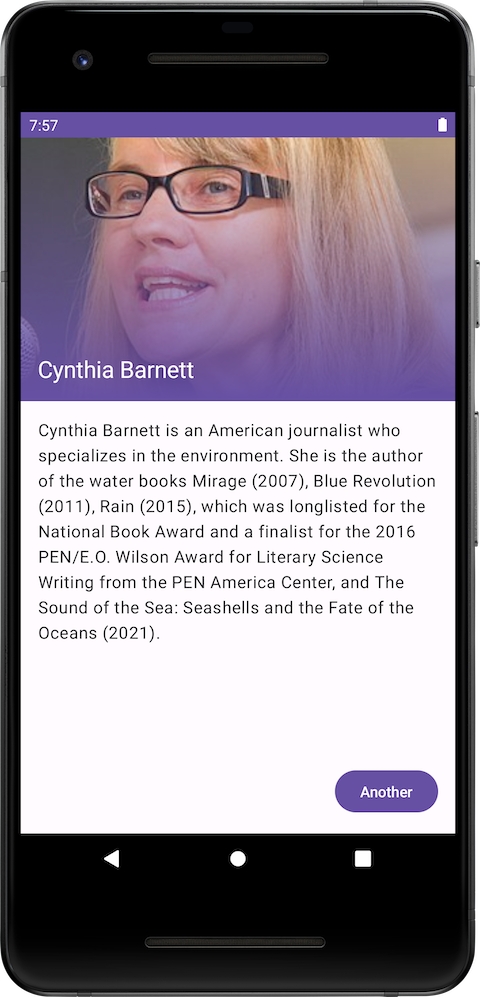

# &nbsp; Knowcean (Android)
Learn random information from Wikipedia(Ocean?). Ocean water before sleep. 🌜

## Screenshots

&nbsp;&nbsp;&nbsp;&nbsp;

## Tech Stack

- MVVM
- JetPack Compose
- Material 3
- Hilt
- Coroutines
- Data Store
- Navigation Compose

## License

[MIT](https://choosealicense.com/licenses/mit/)
